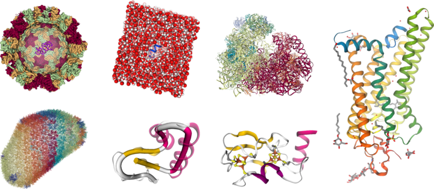

NGL Viewer is a web application for molecular visualization. [WebGL](https://get.webgl.org/) is employed to display molecules like proteins and DNA/RNA with a variety of representations.

See it in action:

* [Web application](http://arose.github.io/ngl/?example=3pqr)
* [API documentation](http://arose.github.io/ngl/doc/)

Features
--------

* Molecular structures (mmCIF, PDB, PQR, GRO, SDF, MOL2, MMTF)
* Density volumes (MRC/MAP/CCP4, DX/DXBIN, CUBE)
* User interaction (mouse picking, selection language, image export)
* Coordinate trajectories (animation, remote access via [MDSrv](https://github.com/arose/mdsrv/))
* Embeddable (single file, API)

Table of contents
=================

* [Installation](#installation)
* [Deployment](#deployment)
* [Acknowledgments](#acknowledgments)

Installation
============

Since the NGL Viewer is a set of static files to be viewed in a web-browser there is not much of an installation needed. For development purposes it will be helpful to clone this repository and serve it locally (see below). The  When embedding the NGL Viewer as a library it is sufficient to include the self contained [embedded build](js/build/ngl.embedded.min.js). The full web application including the GUI requires the full build and some static assets - have a look at the example [html files](html/) for what is required.

Browser
-------

The NGL Viewer requires your browser to support WebGL. To see if your browser supports WebGL and what you might need to do to activate it, visit the [Get WebGL](https://get.webgl.org/) page.

Generally, WebGL is available in recent browser versions of Mozilla Firefox (>29) or Google Chrome (>27). The Internet Explorer supports WebGL only since version 11. The Safari Browser since version 8 (though WebGL can be activated in earlier version: first enable the Develop menu in Safari’s Advanced preferences, then secondly in the now visible Develop menu enable WebGL).

See also [this page](https://www.khronos.org/webgl/wiki/BlacklistsAndWhitelists) for details on which graphics card drivers are supported by the browsers.

__WebGL draft extensions__: For a smoother appearance of cylinders and spheres your browser needs to have the `EXT_frag_depth` extension available. The [WebGL Report](http://webglreport.com/) should list the extension if active. If not, you can enable WebGL draft extensions in your browser following these instructions:

* Chrome: browse to `about:flags`, enable the `Enable WebGL Draft Extensions` option, then relaunch.
* Firefox: browse to `about:config` and set `webgl.enable-draft-extensions` to `true`.
* Safari: Currently, the `EXT_frag_depth` extension is not supported.
* Internet Explorer: Currently, the `EXT_frag_depth` extension is not supported.

Deployment
==========

Any webserver that serves static files will do. If you want to serve the NGL Viewer directly from the repository with the Apache webserver you can do so by creating a symlink:

	ln -s /path/to/ngl-repository/ /var/www/ngl

This assumes the Apache configuration includes somthing like

	DocumentRoot /var/www
    <Directory />
        Options FollowSymLinks
        AllowOverride None
    </Directory>
    <Directory /var/www/>
        Options Indexes FollowSymLinks MultiViews
        AllowOverride None
        Order allow,deny
        allow from all
    </Directory>

Read more about getting started with the Apache webserver [here](http://httpd.apache.org/docs/trunk/getting-started.html).

Acknowledgments
===============

This project would not be possible without recourse to many fine open-source projects. Especially the [three.js](http://threejs.org/) project provides a great foundation.

* [three.js](http://threejs.org/)
    * NGL relies on the three.js library to interface WebGL
    * NGL's documentation uses the three.js documentation as a template
    * NGL's GUI is based on the three.js editor UI
* [sprintf.js](https://github.com/alexei/sprintf.js) - for formatting text
* [jsfeat](http://inspirit.github.io/jsfeat/) - the SVD code for the superposition method is from jsfeat
* [QUnit](http://qunitjs.com/) - for unit testing; [assert-close](https://github.com/JamesMGreene/qunit-assert-close), [Blanket.js](http://blanketjs.org/)
* [Benchmark.js](http://benchmarkjs.com/) - for benchmarking
* [Chroma.js](https://github.com/gka/chroma.js) - for color handling
* [FlexiColorPicker](https://github.com/DavidDurman/FlexiColorPicker) - for color picking
* [Virtual DOM List](https://github.com/sergi/virtual-list)
* [Font Awesome](http://fontawesome.io) - for icons
* [JS Signals](http://millermedeiros.github.com/js-signals)
* [tether.js](http://github.hubspot.com/tether/)
* [Lightweight promise polyfill](https://github.com/taylorhakes/promise-polyfill)
* [pako - zlib port](https://github.com/nodeca/pako)
* [Open Source PyMOL](http://sourceforge.net/projects/pymol/) - screen aligned cylinder shader
* [VTK](http://www.vtk.org/) Quadric shader code from the PointSprite Plugin - quadric surface center calculation
* [HyperBalls](http://sourceforge.net/projects/hyperballs/) - hyperball stick shader - Chavent, M., Vanel, A., Tek, A., Levy, B., Robert, S., Raffin, B., &amp; Baaden, M. (2011). GPU-accelerated atom and dynamic bond visualization using hyperballs: a unified algorithm for balls, sticks, and hyperboloids. Journal of Computational Chemistry, 32(13), 2924–35. [doi:10.1002/jcc.21861](https://dx.doi.org/10.1002/jcc.21861)
